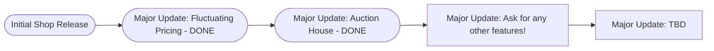

# Velocity's Shop

```This branch works from 1.20.5 to current versions```

## Description

So what actually is this? It's just my dream-project economy plugin that has a couple of pretty cool features (at least in my opinion):
- Sending money to other players
- Auction House for selling custom items
- Fluctuating prices influenced by recent buying/selling habits based on the whole server (See more below)
- And more to come

## Roadmap



## Commands

| Command | Description |
| --- | --- |
| ```/shop``` | Opens the main shop page |
| ```/shop [page]``` | Opens a specific shop page |
| ```/bal``` | Shows your available balance |
| ```/baltop``` | Shows the balances of all players |
| ```/buy [itemname] [amount]``` | Allows you to buy items without opening the shop |
| ```/sell``` | Sells the item that's in your hand |
| ```/sellallhand``` | Sells all the item(s) that are in your hand & inventory |
| ```/sellall [itemname]``` | Sells all the item(s) that match the one you specified |
| ```/ah``` | Opens the auction house |
| ```/ah sell [price]``` | Puts the entire stack of item(s) in your hand up for sale |
| ```/ah mine``` | Opens the auction house and shows only your listings |
| ```/ah claim``` | Collects the items in your claim box |
| ```/ah cancel [id]``` | Takes one of your listings off sale by its number |
| ```/send [playername] [amount]``` | Lets you send any amount to the specified player |

<details>
<summary>Moderator Commands</summary>
    
| Command | Description |
| --- | --- |
| ```/eco give [playername] [amount]``` | Gives the player a specified amount of money |
| ```/eco take [playername] [amount]``` | Removes the specified amount from the player |
| ```/eco set [playername] [amount]``` | Sets the specified player to the amount stated |
| ```/eco reload``` | Reloads the plugin which allows for server owner to make changes without restarting the server |
| ```/eco stock [item]``` | show an item's stock|
| ```/eco stock [item/all] set [amount]``` |set an exact amount |
| ```/eco stock [item/all] add [amount]``` | restock |
| ```/eco stock [item/all] remove [amount]``` | take stock away (stops at 0) |
| ```/eco stock [item/all] reset``` | back to the starting stock |


</details>

## Fluctuating Prices

As mentioned in the description, this plugin has a very cool pricing system. To be put in simple terms, supply and demand. In a more in-depth explanation the plugin has a section that only listens for the ```/buy``` and ```/sell``` commands and whenever someone buys something from the shop gui. Then after logging the recent activity, it then compares that to previous data to determine how much the price will vary by.

## Customization

A pretty cool feature about this plugin is the customization built-in, the shop itself has 3 different types of stock; unlimited, where you can buy as much as you want and sell as much as you want; uncapped, where you can sell as much as you want but only buy as much as what everyone else has sold; and finite, you can only sell as much as the stock has space for (stock can be any value between 1 and 10,000,000). Not only that, but dealing with the actual sections is pretty simple, you're able to put any section anywhere, and any item anywhere. But they are in preset areas in case you don't want to.

---

## Building and Installing

- **Build:** `gradlew.bat build` (Windows) or `./gradlew build`
- **Output:** `app/build/libs/VelocitysShop-1.0.0.jar`
- **Install:** copy the jar into your server's `plugins/` folder and restart.

Compiled for Java 21 against the Spigot API 1.21.11 (`api-version: 1.21`). It runs on Spigot and Paper 1.21.x, and newer servers should load it too. The Spigot API is `compileOnly`, so the jar only contains this plugin's own classes and resources. The version in `plugin.yml` is filled in from `app/build.gradle.kts` when the jar is built.

On first start the plugin creates `plugins/VelocitysShop/` with `config.yml`, `messages.yml` and `shop.yml`. Existing copies are **never overwritten**, so after updating the jar a server keeps its old `shop.yml` and `messages.yml`. Rename one to have the newest default generated again.

It has **no third-party dependencies**: no Vault, no database, no bundled libraries.
- Some default items only exist in newer Minecraft versions (pale oak needs 1.21.4+, the craftable saddle 1.21.6+). Older servers skip them with a warning.
- The economy is not a Vault provider, so Vault-only plugins can't see balances.
