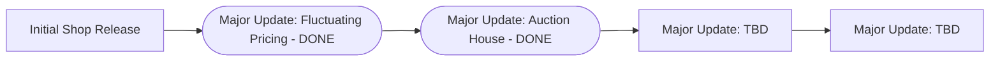

# Velocity's Shop

```This branch works from 1.20.5 to current versions```

## Description

So what actually is this? It's just my dream-project economy plugin that has a couple of pretty cool features (at least in my opinion):
- Sending money to other players
- Auction House for selling custom items
- Fluctuating prices influenced by recent buying/selling habits based on the whole server (See more below)
- And more to come

## Roadmap



## Commands

| Command | Description |
| --- | --- |
| ```/shop``` | Opens the main shop page |
| ```/shop [page]``` | Opens a specific shop page |
| ```/bal``` | Shows your available balance |
| ```/baltop``` | Shows the balances of all players |
| ```/buy [itemname] [amount]``` | Allows you to buy items without opening the shop |
| ```/sell``` | Sells the item that's in your hand |
| ```/sellallhand``` | Sells all the item(s) that are in your hand & inventory |
| ```/sellall [itemname]``` | Sells all the item(s) that match the one you specified |
| ```/ah``` | Opens the auction house |
| ```/ah sell [price]``` | Puts the entire stack of item(s) in your hand up for sale |
| ```/ah mine``` | Opens the auction house and shows only your listings |
| ```/ah claim``` | Collects the items in your claim box |
| ```/ah cancel [id]``` | Takes one of your listings off sale by its number |
| ```/send [playername] [amount]``` | Lets you send any amount to the specified player |

<details>
<summary>Moderator Commands</summary>
    
| Command | Description |
| --- | --- |
| ```/eco give [playername] [amount]``` | Gives the player a specified amount of money |
| ```/eco take [playername] [amount]``` | Removes the specified amount from the player |
| ```/set [playername] [amount]``` | Sets the specified player to the amount stated |
| ```/eco reload``` | Reloads the plugin which allows for server owner to make changes without restarting the server |

</details>

## Fluctuating Prices

As mentioned in the description, this plugin has a very cool pricing system. To be put in simple terms, supply and demand. In a more in-depth explanation the plugin has a section that only listens for the ```/buy``` and ```/sell``` commands and whenever someone buys something from the shop gui. Then after logging the recent activity, it then compares that to previous data to determine how much the price will vary by.
